<!--lint disable no-heading-punctuation-->
# Surfs Up!
<!--lint enable no-heading-punctuation-->

We are planning a long holiday vacation in Honolulu, Hawaii! To help with our trip planning, we decided to do some climate analysis on the area. We have decided to share this analysis with the community by providing a climate analysis api. 

## Step 1 - Data Engineering

The climate data for Hawaii is provided through two CSV files. We first inspect the raw data and clean it up as needed. The Raw Data files are :

* Resources/hawaii_stations.csv
* Resources/hawaii_measurements.csv

The Jupyter Notebook file called `data_engineering.ipynb` does this initial data cleanup

* We use Pandas to read in the measurement and station CSV files as DataFrames.
* We inspect the data for NaNs and missing values.
* We save our cleaned CSV files with the prefix `clean_`.

We determined that only the hawaii_measurements.csv needs cleaning so we generate a new file:

* Resources/clean_hawaii_measurements.csv

---

## Step 2 - Database Engineering

We use SQLAlchemy to model our table schemas and create a sqlite database for the tables. We create one table for measurements and one for stations.

* The Jupyter Notebook called `database_engineering.ipynb` contains all of the Database Engineering work.
* We use `Pandas` to read our cleaned measurements and stations CSV data.
* We use the `engine` and `connection string` to create a database called `hawaii.sqlite`.
* We use `declarative_base` and create ORM classes for each table.
  * We create a class for `Measurement` and for `Station`.

---

## Step 3 - Climate Analysis and Exploration

We now use Python, Pandas, SQLAlchemy, ORM queries and Matplotlib to do basic climate analysis and data exploration on your new weather station tables.

* The Jupyter Notebook file called `climate_analysis.ipynb` contains the climate analysis and data exporation.

### Precipitation Analysis
We create a query to retrieve the last 12 months of precipitation data and plot it

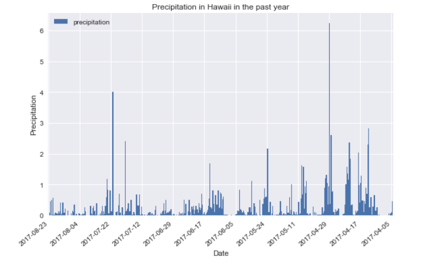

We also print the summary statistics for the precipitation data.

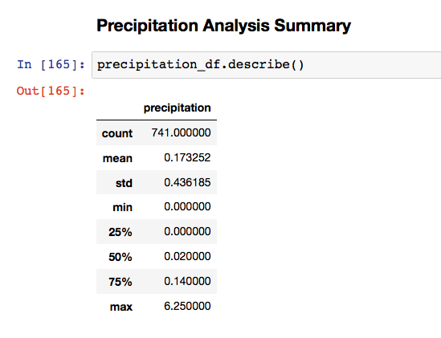

### Station Analysis

* Total number of stations: 9

* Most active stations:

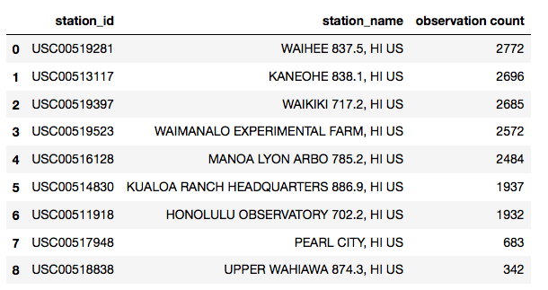

* Histogram of the last 12 months of temperature observation data (tobs) filtered by the station with highest number of observations.

  
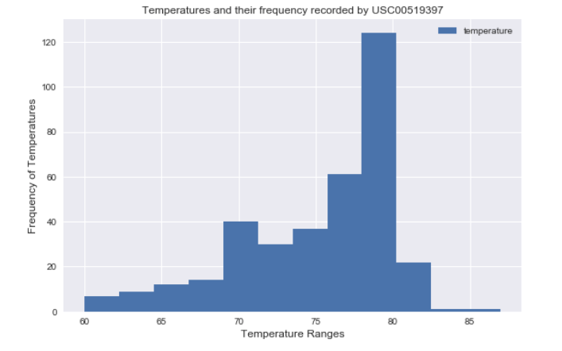

### Temperature Analysis

* We get the min, avg, and max temperatures for your trip using the matching dates from the previous year (i.e. we use "2017-01-01" if your trip start date was "2018-01-01"). We then plot the min, avg, and max temperature from this query as a bar chart with an error bar. 

  * The average temperature is the bar height.
  * The peak-to-peak (tmax-tmin) value is the y error bar (yerr).

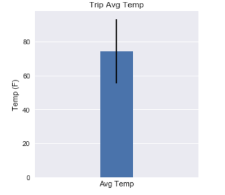

### Average Rainfall per weather station

* We will now find the rainfall recorded by each weather station for the previous year's dates that match our planned trip dates for this year. We calculate the daily normals for all those days. Normals are the averages for min, avg, and max temperatures. Our trip dates are:

Trip Start Date - 05/17/2018

Trip End Date - 05/25/2018

  
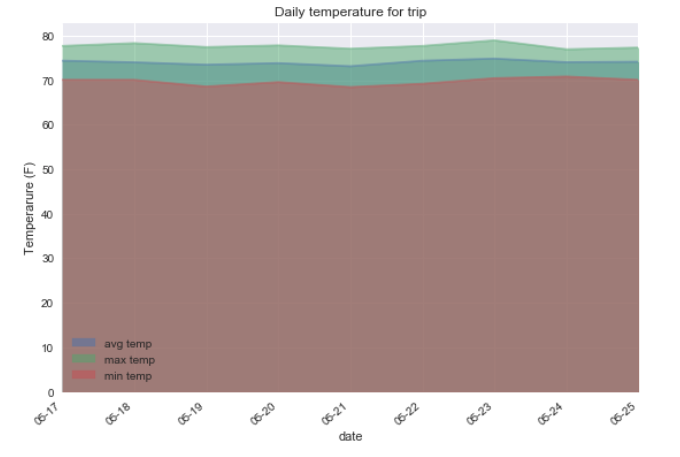

---

## Step 4 - Climate App

Now that we have completed your initial analysis, we design a Flask api based on the queries that we have developed. We use FLASK to create the following routes.

### Routes

#### `/`
This is the root or home end point of the api. This endpoint lists all the available endpoints as shown below

  
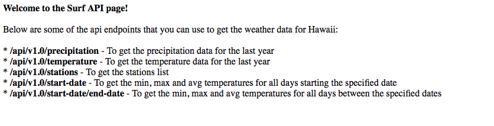

#### `/api/v1.0/precipitation`
Returns the json list of precipitation values from last year

  
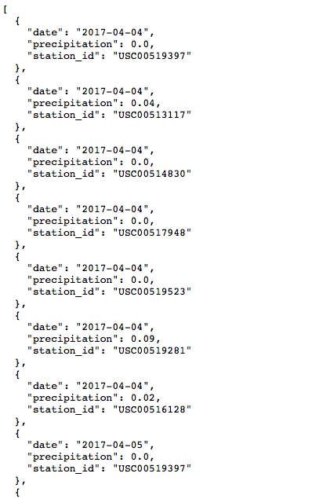

#### `/api/v1.0/temperature`
Returns the json list of temperature values from last year

  
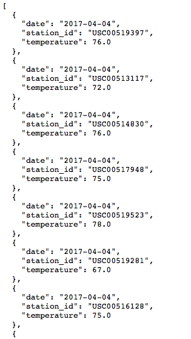

#### `/api/v1.0/stations`
Returns a json list of stations from the dataset.

  
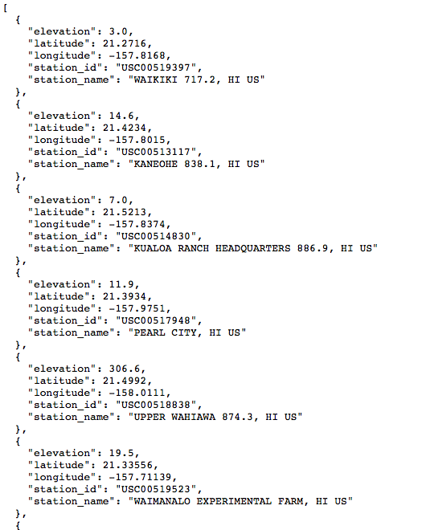

#### `/api/v1.0/<start>` and `/api/v1.0/<start>/<end>`
Return a json list of the minimum temperature, the average temperature, and the max temperature for a given start or start-end range.

  
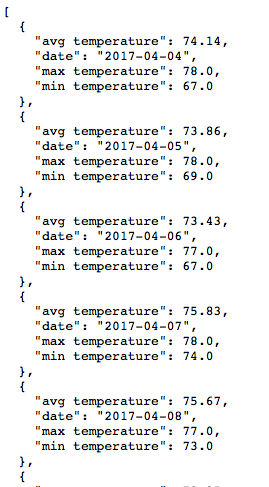

